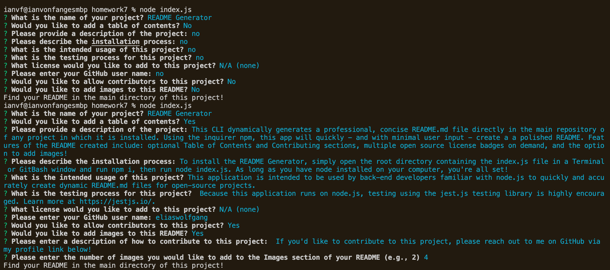
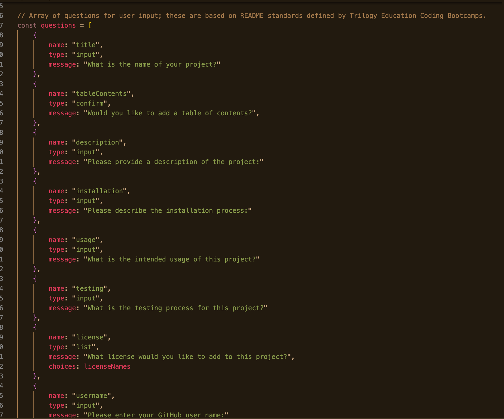

# README Generator

## Table of Contents
  -[Description](#Description)\
  -[Installation](#Installation)\
  -[Usage](#Usage)\
  -[Licenses](#Licenses)\
  -[Contributors](#Contributors)\
  -[Testing](#Testing)\
  -[Questions](#Questions)\
  

## Description
This CLI dynamically generates a professional, concise README.md file directly in the main repository of any project in which it is installed. Using the inquirer npm, this app will quickly - and with minimal user input - create a a polished README. Features of the README created include: optional Table of Contents and Contributing sections, multiple open source license badges on demand, and the option to add images! The README you're reading right now was created using this application!
    
## Installation
To install the README Generator, simply open the root directory containing the index.js file in a Terminal or GitBash window and run npm i, then run node index.js. As long as you have node installed on your computer, you're all set! 
    
## Usage
This application is intended to be used by back-end developers familiar with node.js to quickly and accurately create dynamic README.md files for open-source projects.
    
## Licenses
N/A (none): This project has no licensing requirements.
    
## Contributing
 If you'd like to contribute to this project, please reach out to me on GitHub via my profile link below!

## Testing
 Because this application runs on node.js, testing using the jest.js testing library is highly encouraged. Learn more at https://jestjs.io/.

## Images

Plus, a video demonstrating the app's basic functionality, used to build this README!
<a href="https://drive.google.com/file/d/11o6pI8bjNYI7Z54_73tIKBvuH1cITcN2/view" target="_blank">Watch video</a>

## Questions
To submit questions about this project, please visit my GitHub profile here: https://github.com/eliaswolfgang
